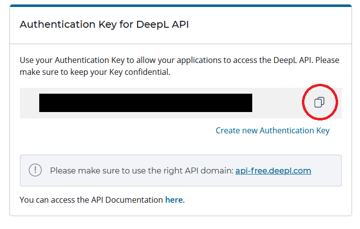
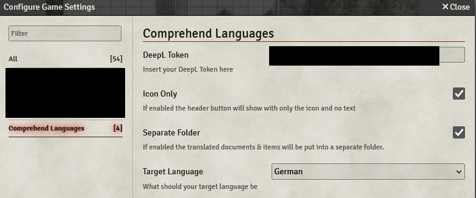
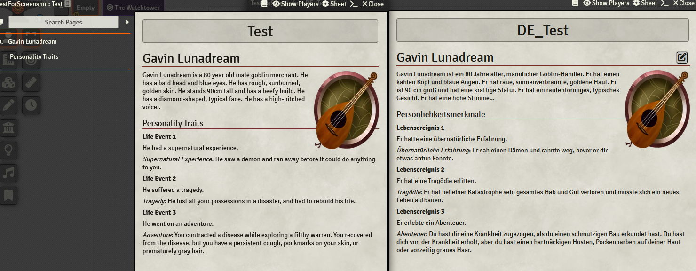

 

# Comprehend Languages

## NOTE: This module is under maintenance, I have no plans to update or add features. However, I will try to fix any bugs as possible. Any contribution is welcome.

Comprehend languages leverages the Deepl API to automatically translate Foundry Journal Entries & (some) item descriptions from English into a language of your choice. In the process, a new journal entry is created that contains the translated text. The module was created specifically with [PDF to Foundry](https://gitlab.com/fryguy1013/pdftofoundry) in mind to help automatically translate adventure description text into the GM's native language.

# How does it work?

A bit of setup work is required before the module functions. You need to create a DeepL API Free account at [Deepl.com](https://www.deepl.com/pro#developer). The Free account should give you way more translated characters than you should need (500.000 characters/month). Unfortunately, a credit card (that will not be charged unless you upgrade to a Pro account) is required for the account creation process.
After setting up your account, go into your DeepL account settings and copy the "Authentication Key for DeepL API".

After enabling the module in your world, open the Module Settings and paste the API Key into the **DeepL Token** input field. Here you can also set your preferred target language.

Now you are good to go. When opening a Journal Entry or Item, a new button appears in the header only for the GM (**Translate**). Click on that button and after a few seconds (depending on the length of the text) a new JournalEntry or Item will be created which is called _xx_OldName_. XX is a two letter abbreviation for your target language. Optionally you can also enable a setting that saves all translated entries into their own folder.

The module retains HTML formatting.

If you find any issues, feel free to contact me directly or file an issue here on GitHub.

# Hotkey Translation of Selected Text

The module also lets you translate selected text via hotkey (default: Alt+T, configurable in the Controls section of Foundry). Simply select any text in a JournalEntry, Item description or even in the chat, press the hotkey and a Dialog with your translation will open shortly. These translations are not persisted. As soon as you close the Dialog, they are gone.

# DeepL CORS Policy

Due to DeepL's CORS policy, browsers block the processing of translations generated by DeepL in accordance with enforced security guidelines. This results in the error message "Failed to fetch."
For this reason, this version includes a proxy operated by me, which adds the missing CORS policy to the retrieved data.
The request must necessarily be routed through the proxy for this to work. Your API key, the content of the text you request to be translated, and the response will pass through this proxy.

# Install this fork of Comprehend Languages

You can install this module by inserting th Manifest Location "https://github.com/STBaf/fvtt-comprehend-languages/releases/latest/download/module.json" to the Manifest URL textbox in the Install Module Dialog on the Add-On Page in the Foundry basic administration.
=======
## Installation

It's always easiest to install modules from the in game add-on browser.

To install this module manually:
1.  Inside the Foundry "Configuration and Setup" screen, click "Add-on Modules"
2.  Click "Install Module"
3.  In the "Manifest URL" field, paste the following url:
`https://raw.githubusercontent.com/p4535992/foundryvtt-comprehend-languages/master/src/module.json`
4.  Click 'Install' and wait for installation to complete
5.  Don't forget to enable the module in game using the "Manage Module" button

